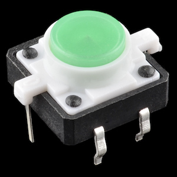

# LedSwitchRK

*Handy library for the SparkFun tactile switch with LED with debouncing*


[SparkFun](https://www.sparkfun.com) has a line of these nice tactile momentary button with various colored caps and built-in LEDs.

- [Green](https://www.sparkfun.com/products/10440)
- [Red](https://www.sparkfun.com/products/10442)
- [Orange](https://www.sparkfun.com/products/10441)
- [Blue](https://www.sparkfun.com/products/10443)
- [White](https://www.sparkfun.com/products/10439)



This library is a simple wrapper around this and the [Debounce](https://github.com/dwcares/debounce) library to detect when the button is pressed and manipulate the LED.

## Usage

You normally instantiate a global LedSwitch object for each switch you have. The constructor takes the led PIN and the switch pin.

The LED pin is intended to be connected to the + side of the LED switch. The other side of the LED connects to GND with a current limiting resistor (68 ohms).

The switch pin is intended to be connected to the momentary switch. The other side of the switch connects to GND. The internal pull-up is used so you don't need an external pull-up resistor.

Call the `pressed()` method on each call to loop(). If it returns true, then the button has been pressed. The press is debounced. There is no support for multiple presses (double click, etc.) at this time.

There are methods to manipulate the LED:

- `ledOn()`
- `ledOff()`
- `ledToggle()`

## Example 1 - Single

```
#include "LedSwitchRK.h"

LedSwitch ledSwitch(D4, D5); // led, switch

void setup() {
}

void loop() {
	if (ledSwitch.pressed()) {
		ledSwitch.ledToggle();
	}
}

```


## Example 2 - Multiple


```
#include "LedSwitchRK.h"

LedSwitch switches[4] = {
		// { LED pin, switch pin }
		LedSwitch(D5, D6),
		LedSwitch(A3, A2),
		LedSwitch(D3, D4),
		LedSwitch(A1, A0)
};

void setup() {
}

void loop() {

	for(size_t ii = 0; ii < (sizeof(switches) / sizeof(switches[0])); ii++) {
		if (switches[ii].pressed()) {
			switches[ii].ledToggle();
		}
	}
}

```


